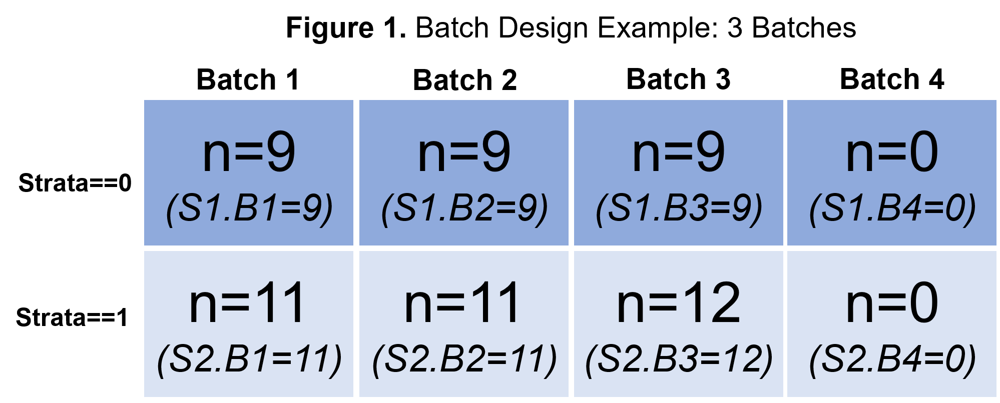
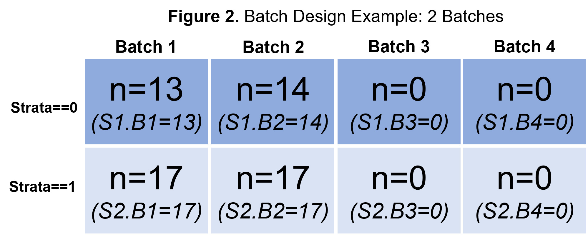
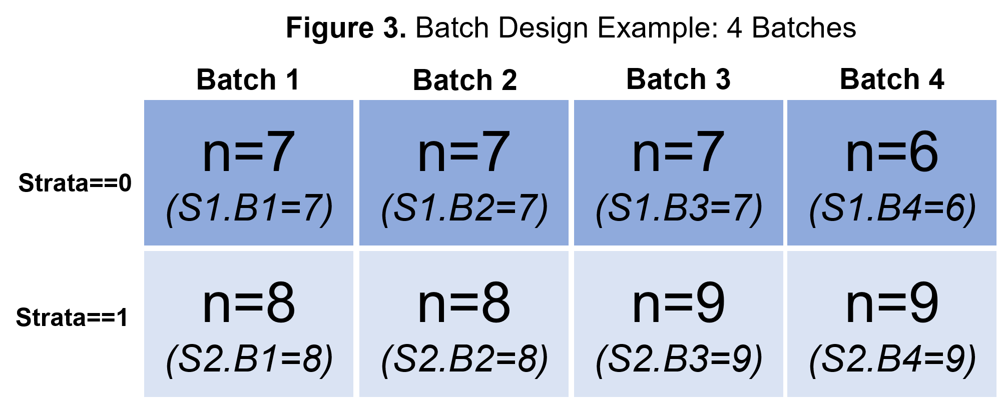

--- 
title: "Optimizing Sample Allocation: Introducing the SR.Allocation, R.Allocation, and Almost.Optimal Sample Selection Functions"
author: "Patrick M. Carry, Tim Vigers, Lauren A. Vanderlinden, Carson Keeter, Fran Dong, Teresa Buckner, Elizabeth Litkowski, Ivana Yang, Jill M. Norris, Katerina Kechris"
date: "Report generated: `r paste(format(Sys.Date(), '%B %d, %Y'))`"
output: 
  html_document:
    toc: true
    toc_float: true
    toc_depth: 5
---


```{r setup, include=FALSE}
knitr::opts_chunk$set(echo = TRUE, warning = FALSE)

# Functions
source("./R/Almost.Optimal.R")
source("./R/R.Allocation.R")
source("./R/SR.Allocation.R")

#Original phenotype file
Pheno = readRDS(file="./Data/Pheno.GSE122288.Clean.Rds")

```

## 1. Overview

Batch effects are ubiquitous in high throughput experiments. Originating from from technical or experimental related factors, batch effects have the potential to bias downstream analyses. Fortunately, "batches" are often known during the experimental design. For example, in the case of RNA extraction, due to lab related resource limitations, it may not be possible to extract all samples within a single day. The extraction may take place over several days and may be carried out by multiple lab technicians. This can result in batch effects in which samples extracted on the same day and/or by the same technician tend to cluster together. In the case of array-based platforms such as DNA methylation and gene expression microarrays, a limited number of samples can be included on each plate, and thus samples must be quantified using multiple plates. Again, samples from the same plate will tend to cluster together. Batch effects create problems when covariates, especially the phenotype of interest, are not equally distributed across batches and as a result, batch effects are correlated with both the exposure (phenotype) and outcome (gene expression, methylation, etc).

In practice, it is typically most efficient to collect all samples and then process/quantify all of the samples at the same time. As a result, measured covariates (age, sex, race/ethnicity, BMI, etc) are known at the time that the samples are assigned to batches. Investigators can exploit this knowledge to design an experiment in which samples are assigned to *known batches* (extraction days, plates, etc) in a manner that ensures equal distribution of the covariates and the phenotype of interest (for example case vs control) across the batches. This is readily accomplished using randomization or stratified randomization approaches. However, across the full randomization space, there will be iterations in which balance in key covariate(s) across batches is less than ideal. Given the investigator likely does not have funds to run the experiment multiple times in order achieve balance in the ‘average covariate’ distribution across batches, it is imperative to select a randomization iteration that minimizes imbalance across batches. 

The purpose of this vignette is to introduce a tool, the *SR.Allocation* and the *Almost.Optimal* functions, to aid in the sample selection process. These functions parallel work by Carry et al in which the authors developed an algorithm to identify the optimal randomization iteration that minimizes imbalance in covariates across batches. The original algorithm considers all possible randomization iterations. As noted by the referees during the peer review process, this approach is very computationally intensive and thus, may not be practical or feasible. Therefore, we developed functions that were adapted from the algorithm developed by Carry et al that are easier to use and more practical. In short, based on a user supplied batch design (see the Randomization Step section below), the *SR.Allocation* function randomizes samples to batches and then the *Almost.Optimal* function selects the randomization iteration that minimizes imbalance, as measured by propensity scores, across batches.

## 2. Motivating Example to Illustrate Function
To illustrate the function, we have downloaded a phenotype file from GEO, GSE122288. The purpose of this study was to quantify genome wide DNA methylation levels from cord blood samples obtained from normal glucose tolerance (NGT) pregnancies. The phenotype file includes several covariates. In this example, we will consider 3 of the covariates in the phenotype file, neonate sex, birth weight, and gestational age. We will consider a **hypothetical scenario** (distinct from the actual experiment) in which, due to resource limitations, a **hypothetical lab** can only process approximately 20 samples per day. As a result, the processing and quantification steps must take place over three days. Knowing the processing will result in three ‘batches’, the investigators would like to assign samples to batches in a way that minimizes imbalance in these covariates across batches. The functions *SR.Allocation* and the *Almost.Optimal* are used to guide this experimental design.

## 3. Selecting the Batch Design – The Design Step

First, we review the covariates. There is an ID variable ("ID"), one dichotomous covariate ("neonate.gender") and 2 continuous covariates ("birth.weight" and "gestational.age"). Based on the phenotype file, there are 61 samples that must be assigned to three batches. It makes the most sense to assign 20 samples to 2 batches and the remaining 21 samples to another batch.

```{r 3.i}
dim(Pheno)
head(Pheno)
```

We recommend a stratified randomization approach in which samples are randomized to batches within the male and female strata, see figure below for visualization. Given there are 27 female samples and 34 male samples, the batch design could look something like:

Batch #1: n=9 female and n=11 male samples

Batch #2: n=9 female and n=11 male samples

Batch #3: n=9 and n=12 male samples

This information will be manually input into the function, see below. 

*Alternative Options: Note, this step relies on input from the investigator and should be determined based on resource availability and covariate distribution. If the phenotype file does not contain any dichotomous variables and/or the investigator does not want to perform stratified randomization, the investigator can use the R.Allocation function to perform randomization only (described below). Finally, sex ("neonate.gender") was selected for stratified randomization, in practice the investigator may want to select another variable, such as case vs. control or treated vs. untreated that is the primary biological covariate of interest.*

```{r 3.ii, echo=FALSE, out.width = '100%'}

```


## 4. Preparing the Dataset
If using stratified randomization, order the phenotype file by the strata variable. The current iteration of this function supports stratified randomization with a single dichotomous variable (for example case vs control). In this example, we are using the ‘neonate.gender’ variable as the strata variable. To make things easier, we create a new variable ‘strata’ based on the ‘neonate.gender’ variable and then sort the dataset. **The phenotype file must be sorted by the strata variable for the SR.Allocation function to work correctly. Sorting is not required for the R.Allocation function, see below.**

```{r 4, echo=TRUE}
#Create new variable for stratified randomization below
Pheno$Strata = ifelse(Pheno$neonate.gender=="male",1,0)

#For stratified randomization, order must be based on a dichotomous variable
Pheno.Sort = Pheno[order(Pheno$Strata ), ]

#Confirm ordering
head(Pheno.Sort)
```


## 5. SR.Allocation - the Randomization Step

Next, we call the *SR.Allocation* function to perform the stratified randomization. The user supplies the number of randomization iterations to be considered. The user also supplies the batch assignments within each batch. This must be determined by the investigator on a case by case basis prior to implementation of the *SR.Allocation* function, see the “3. Selecting the Batch Design” step for more information.

### Definitions for *SR.Allocation* function
**Pheno.Data** = Name of the phenotype file, must be sorted correctly;
**Initial.Seed** = Set the initial seed so that all subsequent iterations are reproducible;
**N.Iterations** = Number of randomization iterations to consider;
**S1.B1** = number of samples assigned to strata #1 batch #1 … **S1.B4** = number of samples assigned to strata #1 batch #4;
**S2.B1** =  number of samples assigned to strata #2 batch #1 … **S2.B4** = number of samples assigned to strata #2 batch #4

In our example, we have 61 samples that must be assigned to 3 batches within 2 strata (male and female). Based on the information in “3. Selecting Batch Design”, we create the following design S1.B1=11, S1.B2=11, S1.B3=11, S1.B4=0 and S2.B1=9, S2.B2=9, S2.B3=9, S1.B4=0 (See Figure 1 for visual representation of the scenario).

Note that the current version of this function supports up to 4 batches. The function can readily be adapted to support more complex situations. Also, if the investigator prefers randomization only, similar code can be implemented using the *R.Allocation* function, see below. 

```{r 5.ii.a, echo = TRUE}
Rand.Space.Output.SR = SR.Allocation(Pheno.Data = Pheno.Sort,
                                     N.Iter=10000,
                                     Initial.Seed=08030104, 
                                     S1.B1=9,  S1.B2=9,  S1.B3=9,  S1.B4=0, 
                                     S2.B1=11, S2.B2=11, S2.B3=12, S2.B4=0)

#NOTE: the function creates a new random seed for each iteration. This seed is stored in the Rand.Space.SR.Output. Set an initial seed so that all subsequent randomization iterations are reproducible.
```

This function will produce a dataset in which each row is a randomization iteration. The first column in the dataset ("X1") is the seed used to generate the batch assignments, column 2 to number of subjects included in the phenotype file (in this example from "X2" to "X62"). 

```{r 5.ii.b, echo = TRUE, eval=TRUE}
head(Rand.Space.Output.SR)
```

*Alternatively, the investigator may be interested in a smaller two batch design (See Figure 2 beloow) or a more complicated, four batch design (see Figure 3 below). As described below, the current function supports up to 4 batches.

```{r 5.iii, echo=FALSE, out.width = '100%'}

```

```{r 5.iv, echo = TRUE}
#Suggested batch design coding for two batch example using phenotype file described above
Rand.Space.Output.SR_2_Batch = SR.Allocation(Pheno.Data = Pheno.Sort,
                                             N.Iter=10000,
                                             Initial.Seed=12370131, 
                                             S1.B1=13, S1.B2=14, S1.B3=0, S1.B4=0, 
                                             S2.B1=17, S2.B2=17, S2.B3=0, S2.B4=0)

```


```{r 5.v, echo=FALSE, out.width = '100%'}

```

```{r 5.vi, echo = TRUE}
#Suggested batch design coding for four batch example using phenotype file described above
Rand.Space.Output.SR_4_Batch = SR.Allocation(Pheno.Data = Pheno.Sort,
                                             N.Iter=10000,
                                             Initial.Seed=73103202,
                                             S1.B1=7, S1.B2=7, S1.B3=7, S1.B4=6, 
                                             S2.B1=8, S2.B2=8, S2.B3=9, S2.B4=9)
```


## 6. Almost.Optimal – Batch Assignment Step
Next, we will implement the *Almost.Optimal* function to iteratively evaluate each of the randomization iterations (created above). Covariate balance is assessed based on propensity scores. The batch allocation iteration that minimizes the differences in average propensity scores is selected as the final batch allocation for the phenotype file. In order for the function to work correctly, the user must supply the names of all covariates (complete data only) as well as the name of the phenotype file and the randomization dataset (created in step #4).

### Definitions for *Almost.Optimal* Function 
**Covariates** = List of all covariates to be modeled in the propensity score models, must appear as "c("Var1", "Var2", "Var3...)". Be sure variables are formatted correctly in phenotype file (ie numeric vs categorical, etc);
**Pheno.Dataset** = Phenotype file, must be sorted;
**Randomization.Dataset** = Name of randomization dataset created above using the SR.Allocation function


```{r 6, echo = TRUE,results = 'hide'}
Pheno.Final.Out.SR = Almost.Optimal(Covariates = c("birth.weight","Strata","gestational.age"),
                                    Pheno.Dataset = Pheno.Sort,
                                    Randomization.Dataset = Rand.Space.Output.SR)
```

The function automatically outputs batch allocations selected based on this balancing metric and adds the allocations to an updated version of the phenotype file named “Pheno.Final.Out”. The “Batch.Assignment.Av” variable represents the ‘almost optimal’ batch allocation selected based on the minimum average difference in propensity scores between batches. The “Av.Rand.N” variable identifies the randomization iteration (row) from the Randomization dataset that was used to create the “Batch.Assignment.Av”. This is useful for identifying the random seed that was used to create this randomization iteration. Finally, the “Batch.Assignment.Imbalance.Av” selects the ‘less than optimal’ allocation (most imbalanced based on maximum difference in propensity scores) as a way to confirm that the Batch.Assignment.Av allocation resulted in improved performance. The “Imbalance.Av.N” identifies the randomization iteration (row) from the Randomization dataset used to create the “Batch.Assignment.Imbalance.Av” iteration. The function includes a timer to track progress.

## 7. Review Covariate Distribution – Evaluation Step

After running all of the steps above, the function will return the final phenotype file. The investigator should carefully review the distribution of covariates across batches. This is readily accomplished using the “table1” R package. 

```{r 7.a, echo=TRUE,message=FALSE}
library(table1)
#Almost Optimal Allocation
table1(~ factor(neonate.gender) + birth.weight + gestational.age | Batch.Assignment.Av, data=Pheno.Final.Out.SR)
```


Most importantly, comparison with the “Imbalance.N” allocation, we can confirm that batch allocation algorithm is working correctly.

```{r 7.b, echo=TRUE}
#Less than Optimal Allocation
table1(~ factor(neonate.gender) + birth.weight + gestational.age | Batch.Assignment.Imbalance.Av, data=Pheno.Final.Out.SR)
```

Here we see that the 'Almost Optimal Allocation' achieves superior balance in gestational.age and gestational.age across the batches. Consistent with the stratified randomization design, the "neonate.gender" is balanced in both scenarios.

## 8. Alternative – Randomization Only

We also illustrate a similar workflow in which investigator wants to implement a simple randomization scheme. Here, we create a new randomization space using the R.Allocation function which only requires batch sample size rather than batch sample size by strata. 

```{r 8.a, echo = TRUE,results = 'hide'}
#Implementing the simple randomization function
Rand.Space.Output.R = R.Allocation(Pheno.Data = Pheno.Sort,
                                   N.Iter=10000,
                                   Initial.Seed=20230401, 
                                   B1=20, B2=20, B3=21, B4=0)

#Evaluating the simple randomization version of the function
Pheno.Final.Out.R = Almost.Optimal(Covariates = c("birth.weight","Strata","gestational.age"), 
                                   Pheno.Dataset = Pheno.Sort,
                                   Randomization.Dataset = Rand.Space.Output.R)
```

Again, we evaluate the balance in the covariates.

```{r 8.b, echo=TRUE}
#Almost Optimal Allocation - randomization
table1(~ factor(neonate.gender) + birth.weight + gestational.age | Batch.Assignment.Av, data=Pheno.Final.Out.R)
```

Comparison with the “Imbalance.N” allocation, demonstrates poor balance in all covariates, including the "neonate.gender" variable.

```{r 8.c, echo=TRUE}
#Less than Optimal Allocation - randomization
table1(~ factor(neonate.gender) + birth.weight + gestational.age | Batch.Assignment.Imbalance.Av, data=Pheno.Final.Out.R)
```

## 9. Limitations and Word of Caution

As noted above, there are several limitations that must be appreciated by the investigator prior to implementation of these functions. First, the current version of these functions is only capable of performing stratified randomization based on a single dichotomous variable. Second, the functions handle up to four batches only. Third, the phenotype file must include complete data. Missing covariates will cause the function to crash. Subsequent work should address these limitations.

Furthermore, we would like to emphasize that, collectively, the *SR.Allocation*, *R.Allocation*, and *Almost.Optimal* functions, are only one of many potential tools to aid in sound experimental design. Investigators must carefully consider all potential sources of error and will still need to carefully review the final batch assignments before sending samples for processing and quantification. For example, the investigator must also consider ordering of samples within batches (extraction order and/or positioning on the plate) and similarly, in case of longitudinal and/or clustered data, investigator should ensure that all samples from same subject or 'independent sampling unit' are included in the same batch. Furthermore, as with any observational study, the investigators must carefully consider potential unmeasured confounders which are likely to impact association testing even when all observed covariates are equally balanced across batches. Finally, our algorithm and accompanying vignette focus on situations where balance in key covariates can be achieved. Finally, there are situations where balance may not be feasible and/or situations in which new batch effects are appreciated after sample processing and quantification. Inclusion of technical replicates is a key methodological consideration to aid in screening for and managing these unanticipated batch effects. We refer reader to Li et al (PMID: 34893807) for more information on batch effects in an unbalanced experimental design.

Overall, our method is meant to minimize potential confounding due to batch effects. Downstream correction of batch effects to remove technical variability and subsequently, to increase precision during statistical modeling should still be considered, but is beyond the scope of this work. 


## 10. Extensions and Potential Alternative Applications

Our functions were developed to aid in the process of assigning samples to batches during experimental design. These functions are expected to perform well in other scenarios in which the investigator desires to obtain balance in a set of covariates between two or more groups/populations. For example, the validation set approach is a classic methodology for evaluating model performance. In brief, the total dataset is divided into a 'training set' and 'validation or hold-out set'. The model is developed in the ‘training set’ and then is tested in the ‘validation set’. In order to prevent selection bias, it is it desirable to ensure that key covariates are balanced between the ‘training’ and ‘validation’ sets. This is analogous to a two-batch experimental design (with unequal batch sizes - the sample size in the 'hold out' set is typically, but not always, smaller). There are other situations in which it is desirable to obtain a random sample from a larger population. For example, when dealing with large administrative datasets, it is often desirable to validate a phenotype definition or an outcome definition that is derived based on a combination of diagnosis codes. Manual chart review is sometimes used to validate these definitions. Manual chart review is resource intensive and, in large datasets, it is not feasible to conduct a chart review in the entire study population. Therefore, a random subset of the population is selected for manual chart review. Again, our functions could be used in this situation, which is analogous to a two-batch experimental design, in order to ensure the key covariates are balanced across the set of individuals selected for manual review versus those who were not selected for manual chart review.
